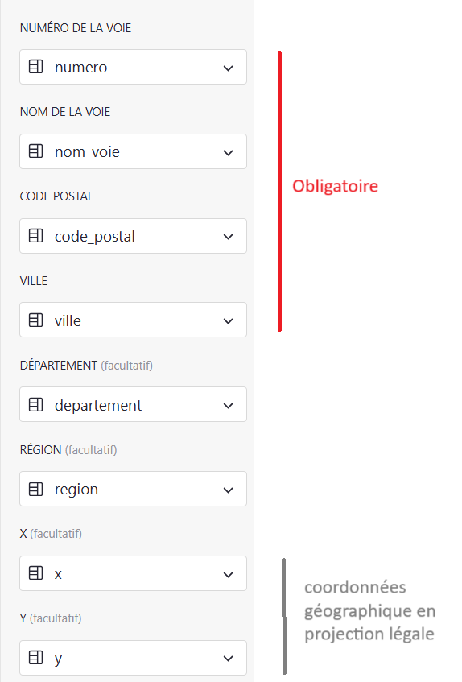
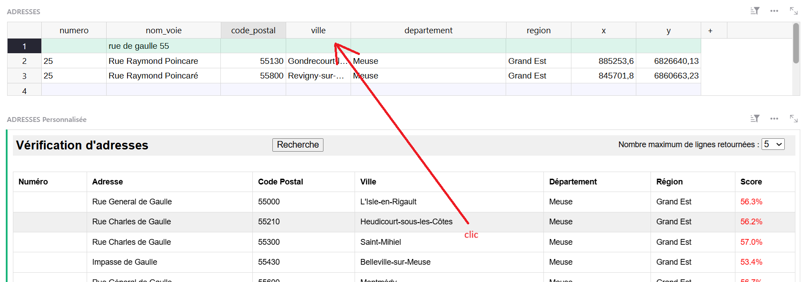

# Vérification d'adresse

Ce plugin permet de vérifier une adresse postale, en interrogeant l'API https://api-adresse.data.gouv.fr/

## Configuration

Identifier les colonnes nécessaires dans la table GRIST

## Utilisation

- Associer ce plugin avec une table GRIST comportant les colonnes adéquates
- Donner au plugin les droits nécessaires pour mettre à jour la table associée
- Configurer les colonnes (au moins les colonnes obligatoires)
- Créer / modifier un enregistrement, puis cliquez sur "Rechercher" : Le plugin vous propose alors les x premiers résultats retournés par l'API "api-adresse-data"
  - NB : Vous pouvez saisir tout **ou partie** de l'adresse (Exemple : saisir "rue de Gaulle 55" dans le nom de la voie)
- **Cliquez sur l'un des résultats** pour mettre à jour la table GRIST

